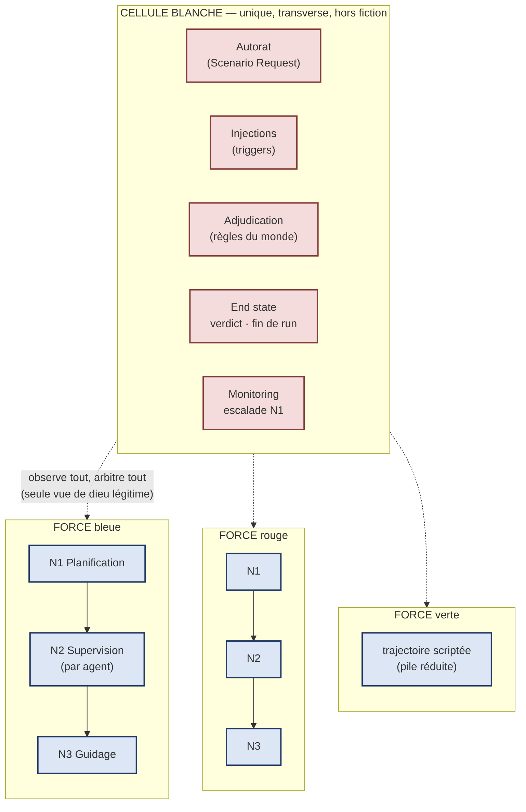
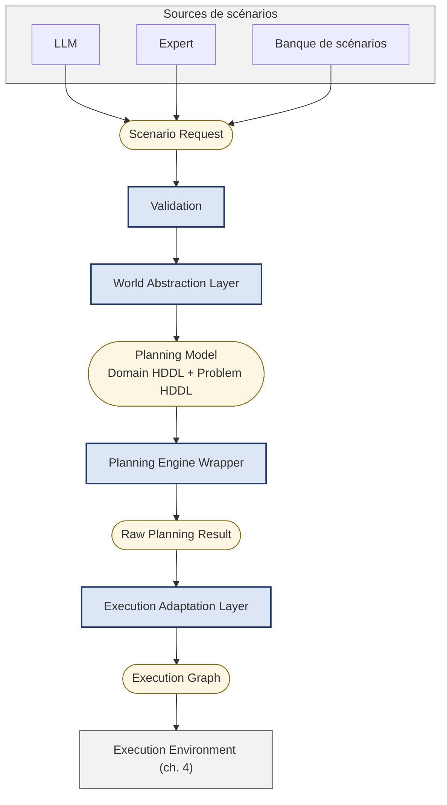

# LSGA v3 — Architecture de référence des scénarios tactiques LOTUSim

> **Statut** : proposition v3.2 — unification de LSGA v2 (Estelle Chauveau) et des
> travaux d'exécution tsm (Cyril Moron). À valider conjointement.
> **Date** : 2026-07-13
> **Lignée** : étend [LSGA v2](https://github.com/cmoron-lab/tactical_scenario_maker/blob/main/docs/lsga-architecture-v2.md) (génération, dans le dépôt `tactical_scenario_maker`) au cycle
> complet du scénario — génération, exécution, arbitrage. Changements v2 → v3
> en [Annexe C](#annexe-c--changements) ; changements v3.1 → v3.2 idem.

## Table des matières

1. [Introduction](#1-introduction)
2. [Modèle d'ensemble — forces, niveaux, cellule blanche](#2-modèle-densemble--forces-niveaux-cellule-blanche)
3. [Niveau 1 — Génération](#3-niveau-1--génération)
4. [Niveaux 2 et 3 — Exécution](#4-niveaux-2-et-3--exécution)
5. [La cellule blanche](#5-la-cellule-blanche)
6. [Modèle conceptuel](#6-modèle-conceptuel)
7. [Contrats des composants](#7-contrats-des-composants)
8. [Scénario de référence — Escorte du détroit d'Ormuz](#8-scénario-de-référence--escorte-du-détroit-dormuz)
9. [Validation, vérification et évaluation](#9-validation-vérification-et-évaluation)
10. [Existant et trajectoire](#10-existant-et-trajectoire)
11. [Limites et perspectives](#11-limites-et-perspectives)
12. [Annexes](#annexes)

---

# 1. Introduction

## 1.1 Objet et contexte

Le présent document décrit l'architecture de référence des **scénarios
tactiques** de LOTUSim : les principes, composants, modèles de données,
contrats et décisions permettant de transformer une description de mission en
un scénario exécutable, de l'**exécuter** avec plusieurs forces autonomes, et
d'en **arbitrer** le déroulement jusqu'à un verdict.

La v2 couvrait la génération (« de la demande au plan »). La v3 couvre le cycle
complet, parce que l'expérimentation a montré que l'aller (générer) et le
retour (observer, réagir, juger) ne peuvent pas être architecturés séparément.
Deux corpus y convergent :

- **LSGA v2** — l'architecture de génération : pipeline orienté modèles,
  planification HTN/HDDL, couches d'adaptation ;
- **le POC tsm** (`tactical_scenario_maker`) — une tranche verticale exécutée
  de bout en bout dans LOTUSim (planification HTN, exécution multi-agents,
  suivi temps réel), qui a validé expérimentalement les choix de la v2 et
  révélé ce qui manquait aux deux architectures (chapitres 2 et 5).

Le document constitue la référence technique des prochains développements de
tsm et a vocation à être maintenu tout au long du cycle de vie de LOTUSim.

## 1.2 Périmètre

Le périmètre comprend : la représentation des demandes de scénarios (toutes
forces, relations, conditions de fin) ; la validation avant planification ; la
construction du modèle de planification et la planification hiérarchique ; la
transformation du plan en graphe d'exécution ; l'exécution (supervision des
agents, soumission d'objectifs aux autonomies, suivi de leur cycle de vie) ;
l'arbitrage (injections, adjudication, verdict, fin de scénario) ; le
monitoring et la traçabilité des runs.

Restent **hors périmètre** (fournis par les plateformes et moteurs de
simulation, consommés au travers de contrats) : les modèles physiques et
environnementaux ; les modèles de capteurs (voir la limite « perception »,
§11.2) ; les algorithmes embarqués dans les plateformes ; l'exécution
distribuée de la simulation.

## 1.3 Principes d'architecture

Les principes P1–P7 de la v2 sont reconduits tels quels ; P8–P10 portent
l'extension du périmètre.

**P1 — Séparation des responsabilités.** Chaque composant possède une
responsabilité unique. Génération, planification, exécution, arbitrage et
simulation sont découplés.

**P2 — Source unique de vérité.** Chaque information possède une unique source
de vérité : le **Domain HDDL** pour la doctrine ; le **Problem HDDL** pour
l'état symbolique d'un scénario ; le **Planning Model** pour ce qui est transmis
au moteur ; l'**Execution Graph** pour le scénario exécutable ; le **Simulation
State**, maintenu par l'environnement d'exécution, pour le monde simulé.

**P3 — Découplage par adaptation.** Le **WAL** (World Abstraction Layer) fait
la transition monde simulé → modèle symbolique ; l'**EAL** (Execution
Adaptation Layer) fait la transition résultat du moteur → modèle d'exécution.
Le moteur de planification n'est jamais exposé directement.

**P4 — Reproductibilité.** À domaine, problème et configuration identiques, le
système produit un résultat reproductible.

**P5 — Validation systématique.** Toute information produite automatiquement
(notamment par un LLM) est non fiable tant qu'elle n'a pas été validée.

**P6 — Séparation entre raisonnement symbolique et simulation.** Le
planificateur raisonne exclusivement sur une représentation symbolique ; la
physique, l'environnement et la perception restent côté exécution.

**P7 — Extensibilité.** Nouveaux types de missions, plateformes, moteurs de
planification ou de simulation s'ajoutent sans remise en cause des principes.

**P8 — Des forces, pas des camps** *(nouveau)*. Un scénario est composé de
N forces — une force est un commandement unifié, pas « l'ennemi du joueur ».
L'hostilité est une **relation entre forces**, non une propriété. Chaque force
décide avec sa seule information ; l'asymétrie d'information est un curseur
explicite du scénario (§2.5).

**P9 — Un scénario a une fin** *(nouveau)*. Tout scénario déclare son **end
state** — critères de succès, d'échec et de timeout — et un composant neutre
(la cellule blanche) l'adjuge en continu. Un run qui ne peut pas se terminer
seul est un défaut d'architecture.

**P10 — Fidélité explicite** *(nouveau, hérité des décisions tsm D6–D8)*. La
fidélité de simulation se choisit **par agent**, via un profil d'exécution
séparé du scénario. Aucune dégradation silencieuse : changer de fidélité change
le sens du résultat, et doit être visible et enregistré avec le run.

---

# 2. Modèle d'ensemble — forces, niveaux, cellule blanche

## 2.1 Anatomie d'un scénario tactique

Une simulation tactique a la même anatomie qu'un exercice naval réel : des
**forces** qui décident chacune pour elle-même, et une **cellule blanche** qui
tient l'exercice.



## 2.2 Le gabarit à trois niveaux, instancié par force

Chaque force instancie le même gabarit de décision — l'architecture à trois
couches classique en robotique (délibératif / exécutif / fonctionnel) recoupée
avec la réalité opérationnelle :

| Niveau | Analogie | Nature | Représentation | Horizon | Responsable |
|---|---|---|---|---|---|
| **1. Planification** | Commandement de la force | HTN symbolique complet, tous les agents *de cette force* | Domain + Problem HDDL | Mission — épisodique | Pipeline de génération (ch. 3) |
| **2. Supervision** | Commandant de bord | HTN local par agent, réparation de plan | État local observé, tâches acquises | Secondes — continu | Exécutif de mission (ch. 4) |
| **3. Conduite / guidage** | Officier de quart, homme de barre | Continu, non symbolique : consignes, asservissements | Trajectoires, poses, waypoints | Hertz | Plateforme / autonomie (ch. 4) |

Une force peut être réduite : un navire isolé est une force d'un agent (la pile
s'effondre en une mission simple) ; un figurant est une force sans niveaux 1-2
(trajectoire scriptée).

**Conséquence sur les moteurs** : moteur HDDL complet (pandaPI ou équivalent)
au niveau 1 ; planificateur HTN léger (type GTPyhop) au niveau 2 ; aucun
planificateur au niveau 3. Chaque moteur trouve sa juste place — le niveau 2
n'a pas à porter le pipeline HDDL.

## 2.3 La cellule blanche

La cellule blanche n'est **pas un niveau de décision** : les niveaux 1-2-3 sont
la chaîne de commandement d'une force *dans la fiction* ; la cellule blanche
est *hors de la fiction*. Elle est unique, transverse et **neutre** — elle
applique les règles uniformément, quelle que soit la force. Elle est la seule
détentrice légitime de la vérité terrain.

Ses cinq responsabilités (détaillées au chapitre 5) :

1. **Autorat** — le Scenario Request décrit toutes les forces, camps confondus ;
2. **Injections** — déclencher les événements scriptés du scénario
   (l'équivalent de la MSEL d'un exercice réel) ;
3. **Adjudication** — appliquer les règles du monde que la physique ne simule
   pas (engagements, dégâts, destruction) ;
4. **Verdict** — évaluer l'end state en continu et terminer le run ;
5. **Monitoring** — journaliser l'exécution et porter le critère d'escalade
   vers la replanification de niveau 1.

## 2.4 Forces et allégeances

Ce qui définit une force est **un commandement unifié** : mêmes objectifs, même
information partagée, un seul plan cohérent. Deux groupes adverses entre eux
sont deux forces — un même commandement ne peut pas produire un plan qui se
combat lui-même.

Il en découle deux objets de première classe du modèle de scénario (§6.1) :

- **la force** : un commandement, des agents, une information propre — N
  forces, sans limite ni symétrie (bleu/rouge/vert n'est qu'une convention de
  nommage relative à l'audience de l'exercice) ;
- **l'allégeance** : une relation entre forces (hostile / neutre / allié /
  protège), potentiellement non-symétrique, et évolutive en cours de scénario
  par trigger (le neutre qui devient hostile quand on lui tire dessus).

Cas limites validant le modèle : deux forces alliées sans liaison = deux
cellules (coalition sans partage d'information) ; du rouge contre rouge ne
demande rien de particulier (la matrice de relations et la neutralité de
l'arbitre suffisent).

## 2.5 L'asymétrie d'information

La v2 qualifiait la planification initiale de « vue de dieu, intégrant tous les
agents ». La v3 dissocie deux rôles que cette formule confondait :

- **l'autorat** (cellule blanche) écrit les missions de *toutes* les forces —
  vue de dieu **légitime** : c'est de la conception d'exercice, hors ligne ;
- **la planification d'une force** (niveau 1) ne devrait connaître que ce que
  son renseignement lui donne — la situation initiale que le scénario déclare
  connue d'elle.

L'asymétrie d'information est un **curseur explicite du scénario**, pas un
tout-ou-rien : vue de dieu partout pour une démo scriptée ; information par
force dès que la simulation sert à évaluer des tactiques ou des autonomies
(sinon le résultat est biaisé — l'escorte « sait » d'où viendra l'embuscade).
Le même curseur s'applique au niveau 2 (ce que perçoivent les superviseurs).

L'argument de la centralisation du niveau 1 reste valide : les contraintes de
communication qui justifient la décision décentralisée s'appliquent à
l'*exécution* embarquée, pas à la génération hors ligne. Le niveau 1 prend la
qualité de la solution globale là où elle est accessible ; les niveaux 2-3
conservent la robustesse décentralisée là où elle est nécessaire.

## 2.6 Discipline de vocabulaire

- **Replanification** : production d'un nouveau plan symbolique — réservé aux
  niveaux 1 et 2.
- **Réparation locale** : replanification de niveau 2, par agent, sur
  représentation réduite.
- **Recalcul de consigne / guidage** : niveau 3, continu, sans planificateur.

## 2.7 Rationale

Ce modèle résout d'un coup les manques croisés relevés lors de la convergence
v2 ↔ POC : la boucle de retour sans responsable (→ cellule blanche), la
frontière replanification/adaptation (→ trois niveaux + critère d'escalade
§4.6), l'absence de conditions de fin (→ end state P9) et le monolithisme du
camp unique (→ forces et allégeances P8). Il est isomorphe à la pratique des
jeux de simulation et des exercices réels — ce qui en constitue la preuve
d'existence à l'échelle.

---

# 3. Niveau 1 — Génération

## 3.1 Vue d'ensemble

Le pipeline de génération est celui de la v2, inchangé dans sa structure :
cinq représentations, quatre transformations, un composant = une transformation.



Ce que le modèle multi-forces (P8) y change :

- le **Scenario Request** est un artefact de cellule blanche : il décrit toutes
  les forces, leurs relations, les triggers et l'end state ;
- la planification produit **un plan par force** — un Problem HDDL par force,
  restreint à l'information que le scénario lui accorde (curseur §2.5). Pour
  une première version, un appel moteur par force suffit ; la cohérence
  d'ensemble est garantie par l'autorat ;
- l'**Execution Graph** descend vers les superviseurs de chaque force, tâches
  affectées par agent (contrat 1 ↔ 2).

## 3.2 Composants

Les garanties contractuelles complètes sont au chapitre 7 ; ici, la fonction
de chaque composant.

**Sources.** Interface utilisateur, LLM, bibliothèque de scénarios, génération
automatique — toutes convergent vers le Scenario Request, aucune n'est
privilégiée.

**Validation.** Première étape du pipeline : cohérence structurelle,
contraintes métier, capacités des plateformes, cohérence des paramètres
(détail au chapitre 9).

**World Abstraction Layer (WAL).** Frontière entre le monde simulé et le
modèle symbolique — seul composant autorisé à construire un Problem HDDL. Il
construit objets, état initial et réseau de tâches, traduit les grandeurs
physiques en **prédicats symboliques calculés** (distances, zones,
disponibilités), applique le profil HDDL. Il ne modifie jamais le Domain HDDL.

**Domain HDDL.** La formalisation de la doctrine opérationnelle — types,
prédicats, tâches, méthodes HTN, opérateurs. Écrit, revu et versionné par les
experts métier ; indépendant de tout scénario. C'est le patrimoine doctrinal
de LOTUSim.

**Planning Engine Wrapper.** Encapsulation complète du moteur HTN — chargement
domaine/problème, appel, récupération, traduction des erreurs. Aucune logique
métier. Moteur de référence : **pandaPI** (sous réserve de licence), avec
GTPyhop en repli à coût nul — déjà encapsulé derrière ce même pattern dans tsm.

**Execution Adaptation Layer (EAL).** Transforme le Raw Planning Result en
Execution Graph : dépendances d'exécution, affectations par agent, format
stable indépendant du moteur. Aucune décision de planification.

## 3.3 Décisions clés (reconduites de la v2)

**HTN/HDDL.** Les opérations navales se décrivent en doctrines et modes
opératoires : l'opérateur décompose une mission en sous-missions jusqu'aux
actions exécutables — le paradigme HTN, cohérent avec le MDMP et les démarches
doctrinales OTAN. HDDL est le standard ouvert associé : séparation
domaine/problème, moteurs multiples, format textuel versionnable. Un **profil
HDDL LOTUSim** définit le sous-ensemble officiel du langage — pivot de
faisabilité de la traduction doctrine → HDDL, premier livrable documentaire
(§10.3).

**Séparation doctrine / scénario.** Connaissances permanentes dans le Domain,
mission particulière dans le Problem : versionnement indépendant,
réutilisation, comparaison, reproductibilité.

**Positionnement du LLM.** Outil d'assistance uniquement : il peut interpréter
une demande, produire un Scenario Request, proposer un Problem HDDL conforme.
Il ne modifie jamais la doctrine ni le Domain HDDL (P5).

**Temps et ressources.** Le planificateur ne raisonne ni sur le temps continu
ni sur des valeurs numériques : dépendances causales pour la structure,
prédicats calculés par le WAL pour les ressources (autonomie suffisante, zone
accessible…). Le continu appartient à l'exécution.

**Replanification de niveau 1 : complète et épisodique.** En cas d'escalade
(§4.6) : capture de l'état courant, nouveau Planning Model, nouvel appel
moteur, nouvel Execution Graph, reprise. Simplicité, robustesse,
reproductibilité — le replanning incrémental reste une piste de recherche. La
*continuité* de la réaction appartient aux niveaux 2 et 3 : c'est le critère
d'escalade qui fait tenir ce choix face à un monde qui change toutes les
secondes.

## 3.4 Rationale

Le pipeline v2 sort intact de la confrontation à l'exécution — c'est sa
validation. Ce qui change n'est pas sa structure mais son *inscription* : il
devient le niveau 1 d'un système à trois niveaux et une cellule blanche, au
lieu d'être toute l'architecture.

---

# 4. Niveaux 2 et 3 — Exécution

Ce chapitre répond au TODO Architecture de la v2 (périmètre et responsabilités
du LOTUSim Execution Environment) ; le contrat correspondant est au §7.4.

## 4.1 Supervision (niveau 2)

Un superviseur **par agent** :

- reçoit ses **tâches acquises** de l'Execution Graph de sa force ;
- maintient un **état local observé** (ce que l'agent perçoit — curseur §2.5) ;
- décide par **HTN local léger** (type GTPyhop) : sélection de branche
  doctrinale, réaction aux succès/échecs d'objectifs, **réparation locale**
  quand une action échoue ;
- soumet des objectifs au niveau 3 sous forme d'**actions typées** (§4.3) et
  n'en considère jamais un comme accompli avant son résultat terminal ;
- publie ses *achievements* (avancement horodaté) vers le monitoring (§5.4).

La replanification de niveau 2 est **événementielle** — déclenchée par un
résultat d'action, un changement d'état observé significatif, une injection —
jamais un polling continu.

## 4.2 Guidage (niveau 3) : plateformes et autonomies

Le niveau 3 tient les consignes en continu : navigation, poursuite,
asservissements. Il n'a aucun planificateur.

Il n'existe **pas de navigation universelle** : atteindre un point est un
problème propre au couple plateforme/autonomie (un voilier tire des bords, un
drone et un sous-marin n'ont ni les mêmes effecteurs ni les mêmes contraintes).
D'où trois décisions structurantes héritées du POC :

- **un agent exécutable = plateforme + autonomie** — deux plateformes
  identiques peuvent exposer des capacités différentes selon l'autonomie
  embarquée ;
- **les autonomies publient leurs capacités** : un manifeste versionné des
  objectifs qu'elles savent accepter (paramètres, résultats possibles),
  consultable hors ligne pour l'édition et vérifié au lancement (registre de
  capacités) ;
- **capacité ≠ faisabilité ≠ résultat** : annoncer `navigation.goto` signifie
  « je sais tenter et produire un résultat », pas « je réussis toujours ». La
  faisabilité dépend de l'état du monde ; le résultat est explicite (succès,
  échec, annulation, timeout).

## 4.3 Le contrat 2 ↔ 3 : actions typées avec cycle de vie

Tout objectif soumis par un superviseur suit le cycle de vie :

```text
soumis → accepté | refusé → en cours (feedback continu) → réussi | échoué | annulé | timeout
```

C'est le protocole des actions ROS 2 (préemption incluse) ; Nav2
(`NavigateToPose`) en est la preuve d'existence à l'échelle. Les actions sont
**typées par famille de capacité**. Familles minimales pour le scénario de
référence (ch. 8) :

| Famille | Exemple | Note |
|---|---|---|
| `navigation.goto` | rejoindre un point ou une zone | l'existant (waypoints) |
| `navigation.follow_target` | tenir une poursuite ou un poste sur cible **mobile** | **la primitive qui manque** — voir §4.7 |
| `engage.attack_target` | engager une cible désignée | résolue par l'arbitre (§5.3) |

Sans `follow_target`, tout exécutif doit re-décider un point fixe en boucle —
la pathologie observée dans le POC (§4.7).

## 4.4 Multi-fidélité et profil d'exécution

Une même capacité peut être implémentée par plusieurs backends :

- **dynamique** : autonomie de plateforme, effecteurs, moteur physique
  (ex. xdyn + pilote) ;
- **cinématique** : waypoint follower ou modèle de mouvement simplifié ;
- **scénarisé** : trajectoire ou adjudication imposée pour produire un effet
  tactique déterminé.

La fidélité se choisit **par agent**, dans un **profil d'exécution** séparé du
scénario (le même scénario se rejoue en cinématique rapide ou avec les acteurs
principaux en haute fidélité). Le profil résolu est enregistré avec le run.
**Aucune dégradation silencieuse** (P10) : un agent dynamique qui échoue ne
bascule pas tout seul en cinématique — changer de fidélité change le sens du
résultat.

## 4.5 Gestion des erreurs d'exécution

| Situation | Comportement |
|---|---|
| Capacité absente du manifeste | Refus à l'édition, incompatibilité signalée |
| Manifeste présent, implémentation absente au runtime | Lancement bloqué |
| Objectif refusé par l'autonomie | Échec explicite remonté au superviseur |
| Objectif accepté mais jamais terminé | Timeout → résultat explicite |
| Autonomie ou moteur déconnecté | Échec avec cause `unavailable` |
| Objectif rendu impossible par l'environnement | Échec ou timeout selon le contrat de l'autonomie |
| Objectif impossible en haute fidélité | Échec propagé — jamais de dégradation silencieuse |

## 4.6 Critère d'escalade

*Chaque niveau rattrape ce qu'il peut et remonte ce qu'il ne peut pas.*

- Guidage en échec (waypoint inatteignable, cible perdue) → **réparation
  locale** par le superviseur de l'agent (niveau 2) ;
- Réparation locale en échec, ou nouvel objectif hors des tâches acquises →
  **escalade** vers la replanification complète de la force (niveau 1), portée
  par le monitoring de la cellule blanche (§5.4).

Ce critère est la frontière formelle entre « adaptation exécutive » (continue,
locale) et « replanification » (épisodique, complète) — sans lui, la première
version la découvrirait dans l'urgence.

## 4.7 La leçon du POC : ne pas fusionner supervision et guidage

La boucle exécutive actuelle de tsm replanifie chaque agent à ~2 s en
poursuite. L'analyse au regard du gabarit §2.2 :

- le *mécanisme* est du niveau 2 (re-décomposition HTN complète, préconditions
  réévaluées) — c'est ce qui permet les vraies bascules de branche (patrouille
  → poursuite → capture → retour), lesquelles sont **épisodiques** ;
- ce qui tourne à ~2 s est du **niveau 3 déguisé** : le même plan à une action
  (`aller_a`) avec des coordonnées rafraîchies. La preuve : la cadence n'est
  pas décidée par le planificateur mais par une hystérésis métrique (~33 m
  entre deux waypoints émis) — signature d'une boucle de guidage ;
- la cause racine est l'absence de primitive « cible mobile » côté plateforme
  (le WaypointFollower ne connaît que des points fixes) : le symbolique
  compense en re-décidant le point fixe en boucle.

La sortie est l'action `follow_target` (§4.3) : le superviseur commande
« poursuis » une fois, le niveau 3 tient la poursuite en continu, le niveau 2
ne replanifie plus que sur événement. La v3 interdit de reconduire cette
fusion.

## 4.8 Rationale

L'Execution Environment de la v2 était une boîte noire « à définir ». Le POC a
fourni la définition par l'expérience : ce qui est resté stable (supervision
par agent, prédicats calculés, wrapper de moteur) entre dans l'architecture ;
ce qui a fait mal (fire-and-forget des waypoints, fusion N2/N3, vue de dieu
implicite) entre comme contre-exemple contractuel.

---

# 5. La cellule blanche

## 5.1 End state et verdict

Constat partagé des deux corpus d'origine : rien ne disait **quand ni pourquoi
un run se termine**. La v2 s'arrêtait à « Simulation State » ; le POC archive
la provenance mais ses runs ne se terminent jamais seuls, et leurs états
(`finished`/`failed`) parlent du *process*, pas de la *mission*.

La v3 rend l'end state obligatoire (P9) :

- le **scénario déclare** ses critères — succès, échec, timeout — comme des
  conditions sur l'état simulé (§5.5) ;
- la **cellule blanche les évalue en continu**, prononce le verdict, termine le
  run et produit le rapport de fin (verdict + provenance + journal).

Vocabulaire de référence : *end state* (planification opérationnelle), mesures
d'efficacité (MOE), critères pass/fail et *stop triggers* (OpenSCENARIO).

## 5.2 Injections (triggers)

Des couples condition → actions évalués par la cellule blanche sur l'état
simulé : apparition d'une force (embuscade), événement d'environnement
(rotation du vent), bascule d'allégeance. L'équivalent de la MSEL (Master
Scenario Events List) d'un exercice réel.

L'horloge de référence des conditions est le **temps simulé**, jamais le temps
mur.

## 5.3 Adjudication — le combat n'est pas de la physique

L'engagement se traite comme dans tout jeu de simulation et tout wargame : un
**arbitre** (portée, cadence, probabilité, points de vie), pas de la
balistique. Mort → suppression de l'entité, résultat d'action explicite.

Architecturalement :

- `engage.attack_target` est une capacité comme les autres (§4.3) dont le
  backend v1 est **arbitré** — littéralement le backend « scénarisé » du §4.4.
  Un backend balistique pourra s'y substituer sans toucher au contrat ;
- l'arbitre est un composant de cellule blanche, pur logiciel côté exécution :
  il consomme les poses, adjuge, émet des suppressions d'entités et des
  résultats d'actions. Aucun plugin de simulation requis.

## 5.4 Monitoring et achievements

Le monitoring journalise l'exécution — démarrages, spawns, plans, résultats
d'objectifs, injections, verdict — et porte le déclenchement de l'escalade
vers le niveau 1 (§4.6).

Les remontées des superviseurs sont des **achievements** : informations
d'exécution horodatées sur l'avancement des tâches acquises. Le modèle de
données exact doit être positionné par rapport à la structure des achievements
de la thèse d'Antoine Milot (supervision HTN locale, tâches acquises forcées,
gestion explicite des échecs de réparation) — point ouvert §11.3.

Le POC fournit l'embryon vérifié : journal d'événements de run, cycle de vie
(un run à la fois, arrêt propre, états), suivi temps réel dans l'IHM.

## 5.5 Un seul langage de conditions

Les conditions des triggers, de l'end state et des préconditions doctrinales
partagent le **même vocabulaire** : `in_zone`, `distance_below/above`, temps
simulé, présence/état d'un agent. Un formalisme unique, deux consommateurs —
la doctrine (décisions d'agent, niveau 2) et la cellule blanche (décisions
d'exercice). C'est le vocabulaire déjà implémenté et testé dans tsm ; on ne
crée pas un deuxième langage.

## 5.6 Rationale

La cellule blanche fait converger trois besoins remontés séparément — le
monitoring sans responsable, le maître du jeu des scénarios de type mission, le
verdict de fin — en **un seul composant** vu sous trois angles. Sa neutralité
et sa vue de dieu légitime en font le complément exact des forces ;
l'alignement sur OpenSCENARIO et le vocabulaire d'exercice garantit qu'on
n'invente rien.

---

# 6. Modèle conceptuel

## 6.1 Les représentations

L'architecture reste **orientée modèles** : une succession de représentations
d'un même scénario, chacune avec un objectif, un responsable unique, un cycle
de vie et des invariants.

| Représentation | Description | Responsable |
|---|---|---|
| **Scenario Request** | Demande structurée : forces, relations, agents, missions, triggers, end state, curseur d'information | Validation (production : autorat cellule blanche) |
| **Planning Model** | Domain HDDL (doctrine) + Problem HDDL par force | WAL |
| **Raw Planning Result** | Sortie native du moteur — transitoire, jamais exposée | Planning Engine Wrapper |
| **Execution Graph** | Scénario exécutable : tâches affectées par agent, dépendances, synchronisations — versionnable | EAL |
| **Profil d'exécution** | Choix par agent : autonomie + fidélité — séparé du scénario | Préparation du run |
| **Simulation State** | État courant du monde simulé — unique vérité terrain | Execution Environment |
| **Journal de run** | Achievements, événements, injections, adjudications, verdict, provenance | Cellule blanche (monitoring) |

Par rapport à la v2 : le Scenario Request s'enrichit (forces, relations,
triggers, end state), et deux représentations font leur entrée — le **profil
d'exécution** (P10) et le **journal de run** (P9), qui est au retour ce que
l'Execution Graph est à l'aller.

## 6.2 Invariants

Reconduits de la v2 : le Scenario Request reste indépendant du planificateur,
de HDDL et de la simulation ; le Planning Model reste conforme au profil HDDL
et indépendant du moteur ; l'Execution Graph reste indépendant du moteur,
exécutable, déterministe et versionnable ; le Simulation State reste l'unique
vérité du monde simulé.

S'y ajoutent :

- le **profil d'exécution** ne modifie jamais l'intention tactique (même
  scénario, fidélités différentes) ;
- le **journal de run** est en append seul, et suffit à reconstituer le
  déroulé et le verdict ;
- l'**état de planification d'une force** ne contient que l'information que le
  scénario lui accorde (curseur §2.5) — la vérité terrain n'existe qu'en
  cellule blanche.

## 6.3 Esquisse du schéma de scénario (v2 du schéma tsm)

Le schéma JSON concret de tsm évolue vers ce modèle — les concepts nouveaux en
première classe, le vocabulaire de conditions réutilisé tel quel :

```json
{
  "version": 2,
  "forces": {
    "bleue": {"agents": ["escorte"]},
    "rouge": {"agents": ["vedette_1", "vedette_2"], "spawn": "deferred"},
    "verte": {"agents": ["cargo_1", "cargo_2"]}
  },
  "relations": [
    {"from": "rouge", "to": ["bleue", "verte"], "attitude": "hostile"},
    {"from": "bleue", "to": "verte", "attitude": "protect"}
  ],
  "agents": { "…": "inchangé (position, modèle, mission, conditions)" },
  "triggers": [
    { "when": {"type": "in_zone", "agent": "cargo_1", "zone": "passe_ormuz"},
      "do":   [{"action": "spawn_force", "force": "rouge"}] }
  ],
  "end": {
    "success": [{"type": "all_in_zone", "force": "verte", "zone": "sortie_ouest"}],
    "failure": [{"type": "agent_destroyed", "force": "verte"}],
    "timeout": "PT30M"
  }
}
```

Ce schéma est un candidat concret pour la structure « à définir » du Scenario
Request (Annexe D de la v2), à confronter à SISO MSDL pour l'ordre de bataille
initial (Annexe B).

## 6.4 Alignement sur les référentiels LOTUSim

Le modèle de scénario instancie les références des trois référentiels
externes sans les redéfinir :

- `ontology_type` référence la **Naval Ontology** ;
- `mission_id` référence le **Mission Catalog** ;
- `task_verb` référence le **Task Catalog** ;
- `capability_type` référence une classe Capability de l'ontologie.

Le modèle de scénario possède l'information contextuelle exclue à dessein des
référentiels : appartenance aux forces et allégeances ; rôles opérationnels ;
relations opérationnelles entre entités ; disponibilité, configuration et
dégradation des capacités ; paramètres propres à la mission ; observations,
pistes et évaluations ; affectation, avancement et complétion des tâches ;
événements, triggers et conditions d'end state.

### Représentation des capacités

L'ontologie définit des capacités physiques potentielles. Un scénario déclare
les capacités disponibles d'un acteur concret et peut les configurer ou les
dégrader :

```yaml
agents:
  usv-001:
    ontology_type: SurfacePlatform
    capabilities:
      - type: MobilityCapability
        status: available
      - type: DetectionCapability
        status: degraded
        parameters:
          effective_range_m: 2500
      - type: CommunicationCapability
        status: available
```

`status`, valeurs de paramètres et dégradations temporaires sont de l'état de
scénario, pas des classes d'ontologie.

### Instanciation de mission

Une instance de mission référence une entrée du Mission Catalog et lie ses
cibles et exigences de capacités abstraites à des entités concrètes du
scénario :

```yaml
missions:
  escort-01:
    mission_id: MC-026
    target:
      role: protected-platform
      entity: fremm-01
    assigned_actors:
      - usv-001
      - usv-002
    parameters:
      protection_radius_m: 1500
```

Les rôles tels que `protected-platform`, `escort-unit`, `suspect-vessel`,
`threat` ou `high-value-unit` appartiennent au modèle de scénario.

### Instanciation de tâche

Une instance de tâche référence un verbe canonique du Task Catalog et fournit
des arguments typés :

```yaml
tasks:
  detect-01:
    task_verb: Detect
    actor: usv-001
    arguments:
      search_area: area-alpha
      target_type: Platform
```

Le Task Catalog définit le verbe et ses signatures typées — chaque signature
porte sa classification de capacité, référençant les classes ontologiques
**les plus spécifiques** applicables (Task Catalog ≥ v0.3). Le Domain HDDL ou
un autre formalisme de planification définit décomposition, prédicats et
ordonnancement.

### Chaîne de résolution : du verbe de tâche à l'action typée

La jonction entre le vocabulaire de planification (verbes du Task Catalog,
niveau 1) et les actions typées du contrat 2 ↔ 3 (§4.3) n'est **pas une table
de mapping** : c'est une traversée des trois référentiels, chacun possédant
exactement un maillon :

```text
Verbe de tâche ──implements_capabilities──▶ Classe Capability ──nmo:manifestKey──▶ Famille d'action typée ──manifeste──▶ Implémentation d'autonomie
 (Task Catalog)                                (Naval Ontology)                        (manifestes de capacités, §4.2)
```

Propriétaires :

- le **Task Catalog** possède verbe → capacité : chaque signature typée
  référence la classe Capability la plus spécifique applicable ;
- la **Naval Ontology** possède capacité → famille d'action typée : les
  classes de capacité correspondant à une primitive d'exécution portent une
  annotation `nmo:manifestKey` (ex. `nmo:TargetFollowingCapability →
  navigation.follow_target`) ;
- les **manifestes d'autonomie** possèdent famille → implémentation : une
  autonomie déclare les clés qu'elle accepte, avec paramètres et résultats
  possibles (§4.2).

Aucun composant ne redéfinit le maillon d'un autre. La résolution est une
simple traversée d'ontologie : une signature de tâche résout vers une famille
d'action typée si l'une de ses classes de capacité (ou une sous-classe) porte
une clé de manifeste.

Deux conséquences :

1. **La couverture croît avec les incréments, pas avec les documents.**
   Seules les classes correspondant à une primitive d'exécution implémentée
   portent une clé (trois aujourd'hui : `navigation.goto`,
   `navigation.follow_target`, `engage.attack_target` — exactement les
   familles du scénario de référence, ch. 8). Les verbes qui ne résolvent pas
   sont des tâches de niveau planification, dont la décomposition (Domain
   HDDL) aboutit à des verbes qui résolvent.
2. **La chaîne est vérifiable mécaniquement** — par le validateur d'intégrité
   référentielle (§9.2).

---

# 7. Contrats des composants

Les contrats définissent les garanties de chaque composant indépendamment de
son implémentation. Règles transverses reconduites de la v2 : **déterminisme**
(entrées identiques → sortie identique), **immutabilité** (une représentation
n'est jamais modifiée en aval), **versionnement** (chaque représentation est
identifiée et versionnée), **traduction des erreurs** (aucune erreur externe ne
se propage nue), **journalisation** (chaque transformation est reconstituable).

## 7.1 World Abstraction Layer

**Produit** : Problem HDDL (par force) et Planning Model. **Garantit** : même
état du monde → même Planning Model ; conformité au profil HDDL ; prédicats
appartenant au domaine officiel ; Domain HDDL jamais modifié ; indépendance
vis-à-vis du moteur ; respect du curseur d'information (§2.5) — le Problem
d'une force ne contient que ce qu'elle connaît. **Ne garantit pas** :
l'existence d'un plan, la réalisabilité, l'optimalité.

## 7.2 Planning Engine Wrapper

**Produit** : Raw Planning Result. **Garantit** : encapsulation complète du
moteur ; Planning Model et Domain jamais modifiés ; erreurs traduites. **Ne
garantit pas** : existence d'un plan, optimalité, performances.

## 7.3 Execution Adaptation Layer

**Produit** : Execution Graph. **Garantit** : indépendance du format vis-à-vis
du moteur ; conservation des dépendances causales et des affectations ; graphe
directement exploitable. **Ne fait jamais** : décision métier, optimisation,
replanification.

## 7.4 Execution Environment (Exécutif de mission + plateformes)

*Répond au TODO Architecture de la v2.*

**Responsabilité.** Exécuter l'Execution Graph de chaque force : superviser les
agents (niveau 2), soumettre les objectifs aux autonomies (niveau 3), suivre
leur cycle de vie, maintenir le Simulation State.

**Consomme** : Execution Graph (par force) ; profil d'exécution ; manifestes
de capacités.

**Produit** : Simulation State (unique vérité terrain) ; flux d'observations
(poses, événements) ; achievements vers le monitoring ; résultats terminaux
d'objectifs.

**Garantit** :

- tout objectif soumis suit le cycle de vie complet (§4.3) — jamais « ordre
  transmis » assimilé à « objectif accompli » ;
- réparation locale d'abord, escalade selon le critère §4.6 — jamais de
  replanification continue par polling ;
- respect du profil d'exécution — jamais de changement de fidélité silencieux ;
- supervision et guidage séparés (§4.7) — la boucle de guidage vit au niveau 3.

**Ne fait jamais** : modifier le Planning Model ou l'Execution Graph ; décider
du verdict du scénario ; accéder à l'information d'une autre force au-delà du
curseur déclaré.

## 7.5 Cellule blanche

**Responsabilité.** Tenir l'exercice : injections, adjudication, end state,
monitoring, fin de run.

**Consomme** : Scenario Request (triggers, end state, relations) ; Simulation
State (vérité terrain — accès légitime) ; achievements des superviseurs.

**Produit** : injections (spawns, événements d'environnement, bascules
d'allégeance) ; résultats d'adjudication (dégâts, destructions, verdicts
d'engagement) ; déclenchements d'escalade vers le niveau 1 ; verdict et rapport
de fin de run (journal + provenance).

**Garantit** : neutralité (règles uniformes pour toutes les forces) ;
évaluation des conditions sur le temps simulé ; un verdict pour tout run
(succès, échec ou timeout — un run ne reste jamais sans fin).

**Ne fait jamais** : planifier pour une force ; communiquer la vérité terrain
à une force au-delà de son curseur ; modifier la doctrine.

## 7.6 Matrice des responsabilités

| Composant | Produit | Responsable de | Ne fait jamais |
|---|---|---|---|
| **WAL** | Planning Model | Modèle de planification par force | Planifier |
| **Planning Engine Wrapper** | Raw Planning Result | Encapsuler le moteur | Modifier le modèle |
| **EAL** | Execution Graph | Modèle d'exécution | Planifier |
| **Execution Environment** | Simulation State, achievements | Supervision + guidage par force | Juger le scénario ; franchir le curseur d'information |
| **Cellule blanche** | Injections, adjudications, verdict, journal | Tenir l'exercice | Planifier pour une force ; divulguer la vérité terrain |

---

# 8. Scénario de référence — Escorte du détroit d'Ormuz

Un scénario type mission de simulation navale, qui exerce **tous** les
contrats du document. Il sert de banc d'essai : chaque incrément de la
trajectoire (§10.2) doit en faire tourner un morceau de plus, et chaque
livrable documentaire se valide contre lui.

## 8.1 Narratif

> Un convoi de deux cargos (force **verte**, civile) transite le détroit
> d'Ormuz vers l'ouest, escorté par une frégate (force **bleue**). Quand le
> convoi entre dans la passe, deux vedettes rapides (force **rouge**) surgissent
> de la côte nord et foncent sur les cargos. La frégate doit les détecter,
> s'interposer et les neutraliser.
> **Succès** : les deux cargos atteignent la zone de sortie ouest.
> **Échec** : un cargo est détruit. **Timeout** : 30 minutes simulées.

Relations : rouge hostile envers vert et bleu ; bleu protège vert ; vert
neutre (il subit). Trois forces, relations non-symétriques — le modèle §2.4 au
complet.

## 8.2 Déroulé annoté — qui décide quoi

| # | Événement | Qui décide | Contrat exercé |
|---|---|---|---|
| 1 | Spawn initial : convoi + escorte à l'entrée est | Cellule blanche (autorat) | Scenario Request multi-forces |
| 2 | Plans initiaux : route du convoi, station de l'escorte, consigne d'attente rouge | Niveau 1 **par force** | Un Problem HDDL par force ; Execution Graph |
| 3 | Le convoi entre dans la passe → apparition des vedettes | Cellule blanche (injection) | Trigger `in_zone` → spawn |
| 4 | L'escorte détecte les vedettes (seuil de portée) | Niveau 2 bleu (bascule de branche) | Prédicat calculé, état local |
| 5 | L'escorte s'interpose entre vedettes et cargo | Niveau 2 bleu → niveau 3 | `follow_target` (poste sur cible mobile) |
| 6 | Les vedettes foncent sur le cargo le plus proche | Niveau 2 rouge → niveau 3 | `follow_target` (poursuite) |
| 7 | L'escorte engage la vedette de tête | Niveau 2 bleu → arbitre | `engage.attack_target` + adjudication |
| 8 | Vedette 1 détruite → suppression de l'entité | Cellule blanche (adjudication) | Résultat d'action : `réussi` |
| 9 | Vedette 2 : effectif sous le seuil doctrinal → repli | Niveau 2 rouge (réparation locale) | Bascule HTN, aucune escalade |
| 10 | Les cargos atteignent la zone ouest → fin du run | Cellule blanche (verdict) | End state `success`, rapport verdict + provenance |

Chaque ligne est un test d'intégration en puissance.

## 8.3 Concessions assumées de la première version

Cinématique partout (le profil d'exécution pourra monter la fidélité agent par
agent ensuite) ; combat arbitré, pas simulé ; détection par seuil de distance
(le modèle « concealment » des jeux de simulation — assumé, voir §11.2) ; vue
de dieu conservée pour l'affichage (le curseur ne filtre que les décisions) ;
l'humain est spectateur.

---

# 9. Validation, vérification et évaluation

## 9.1 Les trois activités

| Activité | Question |
|---|---|
| **Vérification** | Le composant respecte-t-il son contrat ? |
| **Validation** | Le scénario répond-il au besoin utilisateur ? |
| **Évaluation** | Performances et qualité sont-elles satisfaisantes ? |

## 9.2 Vérification

Par contrat (ch. 7), chaque niveau est vérifiable indépendamment :

- **structurelle et syntaxique** : schéma de scénario, conformité HDDL ;
- **intégrité référentielle** : outillée par le validateur
  `validate_referentials.py` — toute référence de capacité et de concept des
  catalogues résout vers l'ontologie, les références croisées entre
  catalogues résolvent, les espaces de noms ne collisionnent pas, et la
  couverture de la chaîne de résolution (§6.4) est rapportée par verbe. À
  exécuter en CI sur tout changement des trois fichiers de référentiel ;
- **contrats de génération** : le WAL ne modifie pas le Domain, l'EAL ne
  planifie pas, les transformations conservent affectations et dépendances ;
- **contrats des autonomies** : publie ses capacités, accepte/refuse
  correctement, produit un résultat terminal ou respecte le timeout, supporte
  l'annulation, ne prétend jamais réussir avant l'effet observable ;
- **contrats d'exécution** : séparation supervision/guidage, critère
  d'escalade, curseur d'information ;
- **contrats de cellule blanche** : neutralité, verdict systématique, temps
  simulé.

## 9.3 Validation métier

Le scénario obtenu répond-il à l'intention ? Mission réalisée, plateformes
cohérentes, contraintes opérationnelles respectées, doctrine suivie — activité
des experts opérationnels, outillée par le rejeu déterministe et le journal de
run.

## 9.4 Évaluation et banc d'essai

L'évaluation s'appuie sur des campagnes reproductibles : performances (temps
de génération, de planification), scalabilité (agents, taille du domaine),
qualité (taux de succès, respect des contraintes), robustesse (données
incomplètes, scénarios impossibles, replanification).

Le POC tsm est le **banc d'essai vivant** de l'architecture : 41 tests
unitaires sans simulateur sur les couches domaine/planification/exécution/web,
scénarios e2e vérifiés dans LOTUSim, et le scénario de référence (ch. 8) comme
cible d'intégration. La Benchmark Suite reste un livrable dédié (§10.3).

## 9.5 Traçabilité

Chaque run conserve : version du scénario, profil d'exécution complet,
versions des autonomies et manifestes, fidélités par agent, versions du
domaine/profil HDDL/moteur/LSGA, journal complet (événements, résultats
d'objectifs, adjudications) et verdict. Cette provenance est ce qui interdit de
présenter un résultat cinématique comme une validation physique.

---

# 10. Existant et trajectoire

## 10.1 Correspondance architecture ↔ POC tsm

tsm implémente une tranche verticale, vérifiée e2e dans LOTUSim (démo :
poursuite multi-agents avec suivi d'exécution temps réel) :

| Composant v3 | Équivalent tsm | Statut |
|---|---|---|
| Scenario Request | Schéma JSON v1 versionné | Implémenté — à étendre v2 (forces, end state, triggers) |
| Validation | Validation structurelle au chargement | Implémenté (structurel) ; validation métier à spécifier |
| WAL | `build_state` + `sync_positions`, préconditions calculées | Implémenté — mêmes « prédicats calculés » |
| Domain HDDL | `knowledge_base.json` + méthodes HTN Python | Implémenté **en code** — delta n°1 : traduction HDDL (dépend du profil) |
| Planning Engine Wrapper | Classe `Planner` (GTPyhop confiné, substituable) | Implémenté |
| EAL / Execution Graph | `make_commands` + runner | Implémenté en **flux** — delta n°2 : artefact versionnable |
| Supervision (N2) | Boucle exécutive par agent (thread, état local, réveil événementiel) | Implémenté — fusion N2/N3 à résorber (§4.7) |
| Guidage (N3) | WaypointFollower LOTUSim (cinématique) | Implémenté — `follow_target` et actions typées manquantes |
| Cellule blanche | Journal d'événements, cycle de vie du run, IHM temps réel | Embryon (monitoring seul) — triggers, adjudication, end state manquants |

Les deltas sont derrière des coutures en place (doctrine derrière un store,
commandes derrière le runner) — résorbables par incréments, sans big-bang.

## 10.2 Incréments logiciels

Chacun petit, validé sur le scénario de référence :

| # | Incrément | Porte | Débloque (déroulé §8.2) |
|---|---|---|---|
| 1 | Schéma v2 : forces, relations, `end` (timeout + zones) | Domaine | Lignes 1, 10 — un run qui se termine seul |
| 2 | Cellule blanche runtime : évalue conditions, injecte, termine | Exécution | Lignes 3, 10 |
| 3 | Actions typées avec cycle de vie, dont `follow_target` | Exécution ↔ LOTUSim | Lignes 5, 6 — sépare N2/N3 |
| 4 | Combat arbitré : `engage.attack_target`, points de vie, destruction | Cellule blanche | Lignes 7, 8, 9 |
| 5 | Perception par force (curseur d'information) | Exécution | Qualité d'évaluation — différable |
| 6 | Doctrine → HDDL, Execution Graph versionnable | Niveau 1 | Trajectoire de fond (dépend du profil HDDL) |

Les incréments 1–4 suffisent à jouer le scénario de référence de bout en bout.

## 10.3 Famille documentaire

Chaque document se valide contre le POC au fil de l'eau, pas en cascade.

| Document | Statut | Note |
|---|---|---|
| **Profil HDDL LOTUSim** | À produire — **premier livrable** | Pivot de faisabilité de la traduction doctrine → HDDL |
| **LOTUSim Naval Ontology** | v2.0-draft existante | 263 classes dont 46 capacités ; annotations `nmo:hasUsageDomain` (diffusabilité) et `nmo:manifestKey` (§6.4) ; NETN-ETR et C2SIM en checklist (Annexe B) |
| **LOTUSim Mission Catalog** | v1.0.3 existante | 66 missions, 9 familles doctrinales, capacités requises par mission |
| **LOTUSim Task Catalog** | v0.6.1 existante | 64 verbes canoniques, 79 signatures typées, capacités par signature |
| **Naval Domain** (Domain HDDL) | À produire | La doctrine formalisée — chemin critique, experts métier requis |
| **Benchmark Suite** | À produire | Scénarios de référence, métriques, protocoles |

Les trois référentiels existants sont vérifiés entre eux par le validateur
d'intégrité référentielle (§9.2).

---

# 11. Limites et perspectives

## 11.1 Limites assumées

**Temps continu.** Le planificateur ne raisonne pas sur le temps continu — les
phénomènes physiques appartiennent à l'exécution (P6).

**Ressources.** Représentation symbolique uniquement (prédicats calculés par le
WAL) ; les modèles numériques détaillés restent côté simulation.

**Replanification de niveau 1 complète.** Le replanning incrémental reste une
piste de recherche ; le critère d'escalade (§4.6) rend la replanification
complète soutenable en la réservant aux vrais événements.

**Dépendance au domaine.** La qualité des scénarios dépend de la qualité du
Domain HDDL : le générateur ne produit que ce que la doctrine représente.

## 11.2 Angle mort identifié : la perception

La détection est aujourd'hui un seuil de distance — le modèle « concealment »
des jeux de simulation, assumé pour la première version. Un vrai modèle de
perception par agent (portées senseurs, conditions, classification) est hors
périmètre mais **préparé** : le curseur d'information (§2.5) définit déjà la
frontière architecturale où il s'insérera.

## 11.3 Points ouverts

1. **Achievements** : positionner le modèle de données du monitoring par
   rapport à la thèse d'Antoine Milot — accès à la thèse requis.
2. **Où vit la cellule blanche runtime** : composant tsm (POC), candidat à
   terme à l'orchestrateur de simulation de l'écosystème LOTUSim.
3. **Manifestes de capacités** : le vocabulaire des clés est désormais porté
   par l'ontologie (`nmo:manifestKey`, §6.4) ; restent ouverts le format et
   l'emplacement des fichiers de manifeste, et la garantie de compatibilité
   manifeste ↔ implémentation au runtime.
4. **État numérique persistant du niveau 2** (angle d'orbite, dernier waypoint
   émis) : répartition explicite supervision/guidage dans le contrat 2 ↔ 3.
5. **Objectifs concurrents** sur un même agent : priorités, préemptions.
6. **API d'environnement** : qui applique les événements d'environnement
   (rotation de vent) injectés par la cellule blanche.

## 11.4 Pistes de recherche

Replanning incrémental ; apprentissage de méthodes HTN ; hybridation HTN +
planification temporelle ; génération assistée de doctrines (sous P5) ;
explication des plans ; interaction homme-planificateur ; modèles de
perception et guerre électronique (brouillage du curseur d'information).

---

# Annexes

## Annexe A — Glossaire

| Terme | Définition |
|---|---|
| **Force** | Commandement unifié : objectifs communs, information partagée, un plan cohérent. N forces par scénario. |
| **Allégeance** | Relation entre forces (hostile / neutre / allié / protège), non-symétrique, évolutive par trigger. |
| **Cellule blanche** | Composant unique, neutre, hors fiction : autorat, injections, adjudication, verdict, monitoring. Seule vue de dieu légitime. |
| **Niveau 1 / Planification** | Commandement d'une force : HTN symbolique complet, épisodique. |
| **Niveau 2 / Supervision** | Superviseur par agent : HTN local, réparation de plan, continu (secondes). |
| **Niveau 3 / Guidage** | Plateforme/autonomie : consignes continues, sans planificateur (Hertz). |
| **End state** | Critères déclarés de succès / échec / timeout d'un scénario, adjugés par la cellule blanche. |
| **Injection (trigger)** | Couple condition → actions évalué par la cellule blanche sur l'état simulé (cf. MSEL). |
| **Adjudication** | Application arbitrée des règles du monde non simulées physiquement (engagements, dégâts). |
| **Achievement** | Information d'exécution horodatée remontée par un superviseur vers le monitoring. |
| **Curseur d'information** | Déclaration par scénario de ce que chaque force connaît (vue de dieu ↔ information par force). |
| **Capacité** | Objectif qu'une autonomie sait accepter et tenter, avec résultat explicite — sans garantie de succès. |
| **Action typée** | Objectif soumis avec cycle de vie complet (soumis → accepté → en cours → terminal), typé par famille de capacité. |
| **Chaîne de résolution** | Traversée verbe → capacité → `nmo:manifestKey` → implémentation reliant Task Catalog, ontologie et manifestes (§6.4). |
| **Profil d'exécution** | Choix par agent d'une autonomie et d'une fidélité, séparé du scénario. |
| **Scenario Request / Planning Model / Raw Planning Result / Execution Graph / Simulation State** | Les cinq représentations du pipeline (v2, reconduites — §6.1). |
| **WAL / EAL / Planning Engine Wrapper** | Les composants de génération (v2, reconduits — ch. 3). |
| **Profil HDDL LOTUSim** | Sous-ensemble officiel de HDDL utilisé par LOTUSim. |

## Annexe B — Standards et systèmes de référence

Principe d'usage : **emprunter la sémantique et les patterns, pas les
formats.** La valeur immédiate des standards est de servir de vocabulaire et de
checklist ; leur valeur future est l'interopérabilité (une architecture dont
les concepts se mappent sur C2SIM/HLA sera intégrable en fédération le jour où
un client l'exigera).

| Concept v3 | Référence | Ce qu'on en retient |
|---|---|---|
| Cycle de vie des objectifs (§4.3) | Actions ROS 2 ; Nav2 `NavigateToPose` | Le protocole goal/feedback/result existe, préemption incluse — ne pas inventer le nôtre |
| Exécutif / cellule blanche (ch. 4-5) | `scenario_runner` (CARLA), esmini ; BehaviorTree.CPP ; PlanSys2 | Conditions/déclencheurs évalués contre l'état simulé ; le planificateur s'engage, l'exécutif surveille |
| Triggers, end state (§5.1-5.2) | ASAM OpenSCENARIO (storyboard, conditions, StopTrigger) ; critères pass/fail façon scenario_runner | Scénario logique vs concret = notre séparation scénario/profil ; déclencheurs conditionnels riches |
| Autonomies et manifestes (§4.2) | Open-RMF *fleet adapters* ; STANAG 4586 | Un adaptateur par plateforme qui déclare ses capacités ; leçon 4586 : assumer la spécificité plateforme |
| État initial, ordres, taxonomies | SISO MSDL, C-BML, C2SIM ; NETN-FOM module ETR | NETN-ETR définit précisément nos tâches (`MoveToLocation`, `FollowEntity`…) avec rapports d'état ; checklist d'ontologie |
| Vocabulaire exercice (ch. 5) | EXCON / cellule blanche, MSEL, end state, MOE | La terminologie opérationnelle de l'arbitrage — on n'invente rien |
| Scénarios maritimes Gazebo | VRX (Virtual RobotX) | Même stack ; plugins de scoring : *le monde juge le succès, pas le pilote* — la cellule blanche en germe |
| Autonomie drone | MAVLink mission protocol / PX4 | Le protocole d'une autonomie drone réelle ; waypoint accepted/current/reached éprouvé |

Sans standard établi — notre part singulière : la multi-fidélité par agent avec
provenance, les autonomies de plateforme elles-mêmes, l'orchestration
multi-processus de la stack LOTUSim.

## Annexe C — Changements

### v2 → v3

1. **Périmètre étendu** : génération → cycle complet (génération, exécution,
   arbitrage). Le TODO Architecture v2 (Execution Environment) est résolu
   (ch. 4, 5, §7.4-7.5).
2. **Modèle d'ensemble nouveau** (ch. 2) : N forces avec allégeances, gabarit
   trois niveaux par force (note du 12/07 intégrée), cellule blanche en layer
   orthogonal, curseur d'asymétrie d'information (requalification de la « vue
   de dieu » v2).
3. **Principes P8–P10** ajoutés (forces, end state, fidélité explicite).
4. **Cellule blanche** (ch. 5) : end state/verdict, injections, adjudication,
   monitoring/achievements — concepts absents de la v2 et du POC.
5. **Contrat 2 ↔ 3 en actions typées** avec cycle de vie, famille
   `follow_target` ; interdiction contractuelle de la fusion supervision/guidage
   (leçon du POC, réponse à la question §9 de la note du 12/07).
6. **Moteurs par niveau** : pandaPI (ou équivalent HDDL) au niveau 1, GTPyhop
   au niveau 2 — lève la tension licence/expressivité de la v2.
7. **Représentations ajoutées** : profil d'exécution, journal de run (§6.1) ;
   Scenario Request enrichi (forces, relations, triggers, end state).
8. **Scénario de référence** (ch. 8) et trajectoire par incréments ancrée au
   banc d'essai tsm (ch. 10) — remplace la roadmap logicielle « Étape 1
   prototype minimal » (le prototype existe).
9. **Absorption d'ARCHITECTURE.md (tsm)** : décisions D1–D8 (agent =
   plateforme + autonomie, manifestes de capacités, cycle de vie des objectifs,
   multi-fidélité, profil d'exécution, non-dégradation), gestion des erreurs
   d'exécution, standards de référence.
10. **Redondances v2 réduites** : rationales fusionnés, contrats condensés à
    garanties égales.

### v3.1 → v3.2

1. **§6.4 traduit en français** (seule section en anglais d'un document
   français) et **complété par la chaîne de résolution** verbe → capacité →
   `nmo:manifestKey` → implémentation, avec un propriétaire par maillon.
2. **§9.2** : la vérification d'intégrité référentielle est outillée
   (`validate_referentials.py`, exécution en CI).
3. **§10.3 et Annexe D** : statuts des référentiels mis à jour — Naval
   Ontology v2.0-draft, Mission Catalog v1.0.4, Task Catalog v0.6.1 existent ;
   la « famille documentaire à venir » ne concerne plus que le Profil HDDL, le
   Naval Domain et la Benchmark Suite.
4. **§11.3 point 3 resserré** : le vocabulaire des clés de manifeste est
   possédé par l'ontologie ; restent ouverts le format des fichiers et la
   compatibilité runtime.
5. **Passe éditoriale globale** : fusion §1.1/§1.2, suppression de l'ancien
   §1.5 (structure du document, redondant avec la table des matières),
   rationales condensés (§2.7, §5.6), renvoi des descriptions de composants
   (§3.2) vers les contrats du ch. 7. Aucun changement de fond.

## Annexe D — Documents de référence

**Référentiels existants** (vérifiés entre eux par `validate_referentials.py`,
§9.2) :

- **LOTUSim Naval Maritime Ontology** v2.0-draft (`.ttl`, OWL/Turtle) ;
- **LOTUSim Mission Catalog** v1.0.3 ;
- **LOTUSim Task Catalog** v0.6.1.

**Documents amont et connexes** :

- [LSGA v2](https://github.com/cmoron-lab/tactical_scenario_maker/blob/main/docs/lsga-architecture-v2.md) (Estelle Chauveau) — le document d'origine
  du niveau 1 ; sa version .docx reste la référence éditoriale côté PO. Hébergé
  dans le dépôt `tactical_scenario_maker` (Cyril Moron), pas dans ce dépôt —
  voir [note de coordination](../notes/2026-07-14-etat-des-lieux-interface-tsm.md)
  sur l'absence de source canonique unique pour ce document.
- Runbook du rig d'intégration : [rig-e2e.md](https://github.com/cmoron-lab/tactical_scenario_maker/blob/main/docs/rig-e2e.md)
  (également dans `tactical_scenario_maker`).
- À produire : Profil HDDL LOTUSim, Naval Domain, Benchmark Suite (§10.3).
- Historique : la review LSGA v2 (11/07), la note « Trois niveaux de
  décision » (12/07), le document de convergence `architecture-unifiee.md` et
  l'architecture tsm `ARCHITECTURE.md` sont absorbés par la présente v3 —
  texte intégral dans l'historique git.
