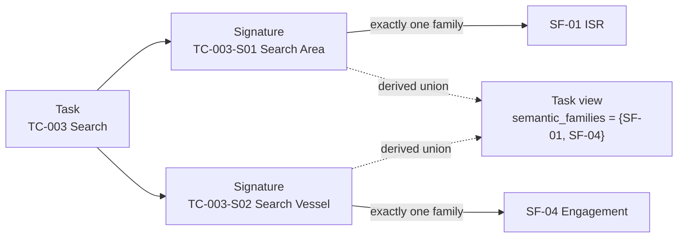

# LSG Domain Engineering Method (DEM)

# DEM-2 — Task Catalog Specification

**Version:** v0.6 (Draft)

---

# 1. Purpose

This document specifies the normative metamodel of the Task Catalog for **LSG — LOTUSim Scenario Generator**.

---

# 2. Scope

The Task Catalog is the normative repository for operational tasks and their signature-level semantics.

It contains:

- Semantic Families;
- Tasks;
- Typed Signatures;
- Operational Semantics;
- Execution Semantics;
- Traceability.

It does **not** contain HDDL constructs, planner-specific predicates, simulator algorithms or autonomy implementation details. No separate Task Semantics Catalog shall be maintained.

---

# 3. Task Catalog Organization

```text
Task Catalog
│
├── Semantic Families
│     ├── ISR
│     ├── Movement
│     ├── Protection
│     ├── Engagement
│     ├── Support
│     ├── Command & Control
│     └── Logistics
│
└── Tasks
      ├── Detect
      ├── Track
      ├── Navigate
      ├── Escort
      └── ...
```

Semantic Families are first-class elements of the Task Catalog, but membership is owned by typed signatures rather than generic verbs.



The diagram shows why family membership cannot be stored once on `Search`: its two typed operational uses inherit different common semantics. The task remains one stable verb, while each signature has one unambiguous family.

---

# 4. Semantic Family Metamodel

Each family defines once:

- operational objective;
- manipulated concepts;
- common state reads and transitions;
- invariants;
- common terminology;
- validation rules.

Signatures reuse these common semantics and only define the specialization required by their typed operational use.

```yaml
id: SF-01
name: ISR
operational_objective: ...
manipulated_concepts: []
common_semantics:
  reads: []
  invariants: []
  transitions: []
terminology: []
validation_rules: []
```

Family membership lists are derived from signature references; they are not duplicated inside family records.

---

# 5. Task Metamodel

Each task defines:

- identifier;
- canonical verb and definition;
- one or more typed signatures;
- traceability.

A task does not own a singular Semantic Family. Its optional display-level `semantic_families` view is the set union of the `semantic_family` values declared by its signatures and shall not be stored as an independent normative field.

---

# 6. Signature Metamodel

Each signature defines:

- stable signature identifier;
- exactly one Semantic Family reference;
- typed parameters;
- required capabilities;
- applicability;
- operational semantics;
- execution semantics;
- specialization of its Semantic Family;
- traceability to missions and ontology concepts where applicable.

Semantics and family membership belong to the typed signature, not to the generic task alone.

```yaml
signature_id: TC-003-S01
semantic_family: SF-01
legacy_name: Search Area
```

## 6.1 Parameter and binding sources

Every parameter defines a unique role, a controlled type reference and its source:

- `task_input`: supplied when the task instance is created;
- `state_at_start`: captured by matching an explicit state tuple before any task effect is applied;
- `execution_output`: a typed value produced or estimated by the executor and bound before the corresponding effect or completion condition is evaluated.

```yaml
parameters:
  - role: actor
    type: nmo:Platform
    source: task_input
  - role: origin
    type: nmo:SpatialRegion
    source:
      kind: state_at_start
      state_ref: SM-ST-001
      bindings: {entity: actor, location: origin}
  - role: estimate
    type: SM-TY-006
    source:
      kind: execution_output
      produced_by: localization
```

Every variable appearing in `bindings` shall resolve to a declared parameter. Ontology concepts used as constants, such as a capability class, are exempt from parameter declaration but shall resolve in the ontology.

Parameter types used by enriched semantics shall resolve either to a Naval Maritime Ontology class through the `nmo:` prefix or to a State Model-owned `SM-TY-NNN` type. A parameter bound to a state argument shall be type-compatible with that argument.

A removal effect shall name the same State Model identifier as the tuple it removes and bind every component needed to identify that tuple. Placeholder identifiers such as `located_at_previous_location` are invalid.

---

# 7. Signature Semantic Structure

```yaml
semantics:
  semantic_kind: # primitive | abstract | external_event | out_of_planning_scope
  execution_pattern: # instantaneous | durative | continuous

  parameters: []
  reads: []
  invariants: []

  applicability:
    operational: []
    execution: []

  operational_effects:
    world:
      add: []
      remove: []
    knowledge:
      add: []
      remove: []
    resources:
      add: []
      remove: []

  desired_outcomes: []
  completion_conditions: []
  termination_conditions: []
  failure_outcomes: []

  execution:
    responsibility:
```

World state and force-relative knowledge are distinct. Execution information describes how a task may be realized but shall not define its operational meaning.

Abstract tasks express desired outcomes, completion conditions and failure outcomes; their `operational_effects` shall not directly add or remove symbolic state. Primitive tasks may produce symbolic state transitions.

State references remain planner-independent. Every enriched signature shall use `state_ref` with a normative `SM-ST-NNN` identifier. The State Model supplies the readable symbol, category, argument signature and lifecycle.

For `instantaneous` and `durative` signatures, `completion_conditions` define successful completion. For `continuous` signatures, `termination_conditions` define the normal reasons why execution stops; termination is not failure unless a matching `failure_outcome` is established.

## 7.1 ISR knowledge progression

ISR signatures shall bind an explicit `knowledge_holder`. Their world-effect lists remain empty unless the task also performs a distinct physical action.

The canonical progression is branching:

- Observe produces holder-accessible evidence about an area without asserting target presence.
- Detect establishes holder-relative knowledge of an object or emission.
- Localize, Classify and Track may independently consume detection knowledge.
- Identify normally consumes classification knowledge, but may instead use direct identity evidence.
- Track is continuous; normal stop conditions are distinct from loss of track.

An inconclusive sensing attempt is represented as an attempt outcome, never as proof that the target is physically absent.

---

# 8. Validation Rules

- Every signature references exactly one Semantic Family.
- Every family contains at least one signature.
- Every task defines at least one typed signature.
- Common semantics are defined only once at family level.
- Task signatures define only their specialization of family semantics.
- Any task-level family view equals the derived set union of its signature families and is not maintained independently.
- Every signature defines typed parameters, required capabilities where applicable, state reads and/or effects, and failure outcomes.
- Instantaneous and durative signatures define completion conditions; continuous signatures define normal termination conditions.
- Every signature declares exactly one execution pattern.
- Every binding variable resolves to a parameter declared by the same signature.
- Every `state_ref` resolves to a normative State Model entry.
- State bindings contain exactly the argument roles declared by that State Model entry.
- Bound parameter types are compatible with the corresponding State Model argument types.
- Every parameter declares a valid binding source.
- Every `execution_output` is typed and declares its producing execution function.
- Every knowledge effect binds an explicit information holder.
- Every state removal identifies a complete, explicitly bound tuple and does not use a pseudo-state for a previous value.
- Every continuous signature declares at least one normal termination condition.
- Abstract signatures do not directly modify symbolic state.
- World-state effects and force-relative knowledge effects are not conflated.
- Ontology concepts and capabilities referenced by a signature exist in the Naval Maritime Ontology.

---

# 9. Traceability and State Model Derivation

```text
Naval Maritime Ontology ─┐
Mission Catalog ─────────┼─> State Model ─> HDDL Domain / Problems
Task Catalog ────────────┘
```

The State Model is derived from relevant ontology relations, task reads and effects, and mission preconditions and objectives. Its normative machine-readable source is `references/state-model/LOTUSim_State_Model_v0.4.yaml`; its metamodel and decisions are documented by `specification/state-model/LOTUSim_State_Model_Specification_v0.4.md`. HDDL artifacts are then derived from the State Model; they do not introduce independent business semantics.

---

# 10. v0.2 Consolidation Notes

Version v0.2 consolidated the elements required to make explicit:

- the absence of a separate Task Semantics Catalog;
- the first-class status of Semantic Families;
- signature-level capability and semantic ownership;
- state reads and invariants;
- the separation of world state and force-relative knowledge;
- the non-mutating nature of abstract tasks;
- the three-source derivation of the State Model.

---

# 11. Changes from v0.2 to v0.3

- Stabilized the signature semantic structure used by the semantic pilot.
- Added explicit parameter sources and state-at-start capture.
- Required complete typed bindings for all state references and tuple-exact state removal.
- Prohibited placeholder state identifiers for unknown previous values.
- Made execution patterns mandatory and clarified normal termination of continuous tasks.
- Confirmed that abstract tasks express desired outcomes but have no direct operational effects.

---

# 12. Changes from v0.3 to v0.4

- Moved Semantic Family ownership from generic tasks to typed signatures.
- Required stable identifiers and exactly one family reference for every signature.
- Defined task-level family membership as a derived union.
- Added the canonical Semantic Family metamodel and an explanatory diagram for multi-family verbs.

---

# 13. Changes from v0.4 to v0.5

- Added `execution_output` for typed observations, evidence, estimates, assessments and tracks produced during execution.
- Required explicit information holders for knowledge effects.
- Defined the canonical branching ISR knowledge progression and the treatment of inconclusive sensing outcomes.

---

# 14. Changes from v0.5 to v0.6

- Required stable `state_ref` identifiers in enriched signatures.
- Required exact conformance between task bindings and the canonical State Model tuple signature.
- Registered State Model v0.1 as the normative state source for task semantics and downstream derivations.
